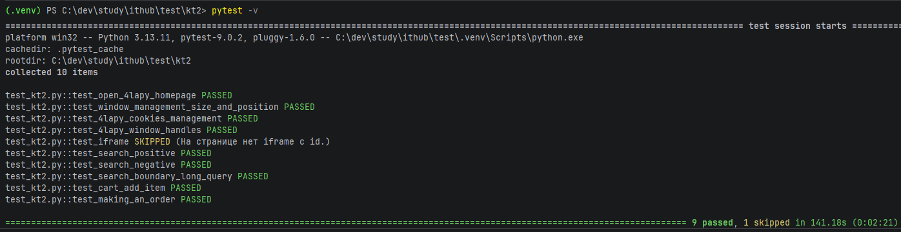

# Тестирование функционала веб-приложения с применением техник тестирования.
Модульное тестирование веб-приложений  КТ № 2 Практическая работа

## Выбранное приложение
**https://4lapy.ru/** — крупный интернет-магазин для животных. Сайт доступен, имеет поиск, каталог, корзину и оформление заказа.

## Ключевые функциональные сценарии для покрытия
- **Поиск товаров**: основной путь пользователя, проверенный позитивно, негативно и граничными запросами.
- **Корзина и оформление заказа**: добавление товара и переход к оформлению с проверкой появления элементов страницы.
- **Управление сессией**: cookies и состояние корзины после сброса (эпизод граничных значений).
- **Взаимодействие браузера**: размеры/позиция окна и их влияние на отображение.

## Детализированные тестовые сценарии
1. **Позитивный поиск по слову «корм»**
   - Сценарий: ввод видимого запроса, ожидание, что результат (список, упоминание запроса) отображается.
   - Тестовые шаги: открыть страницу, найти поисковое поле, ввести «корм», нажать Enter, дождаться отправки и проверки страницы результатов.
2. **Негативный поиск по несуществующему товару**
   - Сценарий: поиск несуществующего товара должен показать блок «ничего не найдено» или аналогичное сообщение.
   - Цель: убедиться, что пользователь получает корректную обратную связь (не просто ошибка, а понятный результат).
3. **Граничный поиск с запросом длины 1000 символов**
   - Сценарий: отправка очень длинного запроса и фиксирование корректной реакции (переход по URL, результат, «не найдено» или «поиск»).
   - Этот сценарий проверяет устойчивость поиска к экстремальным значениям ввода.
4. **Добавление товара в корзину и проверка содержимого**
   - Открыть домашнюю страницу, кликнуть кнопку «добавить в корзину», убедиться, что счетчик обновился и на странице корзины появились позиции.
   - После этого очистить cookies, обновить старую страницу и убедиться, что корзина пуста (сценарий устойчивости сессии).
5. **Оформление заказа до блока регистрации**
   - Добавить товар в корзину, открыть корзину, нажать кнопку «Оформить заказ», проверить отображение блока регистрации (заголовок, поле телефона).
   - Здесь проверяется переход на следующий шаг и наличие пользовательских форм.
6. **Работа с cookies**
   - Создать тестовый cookie, убедиться в его наличии (как добавленном, так и в списке), удалить и подтвердить, что cookie больше нет.
7. **Управление окнами**
   - Открыть новую вкладку через `window.open`, переключиться, проверить URL, закрыть новую вкладку и вернуть фокус на исходное окно.
8. **Размеры и позиция окна**
   - Поставить окно в позиции `(0,0)` и размер `1280x720`, убедиться, что размеры окна удовлетворяют минимальным порогам (>=1200x650).

## Среда и запуск
1. Установить зависимости: `pip install -r requirements.txt`.
2. Запуск базовых тестов: `pytest kt2/test_kt2.py -v`.

---

# Анализ результатов и отчет

## Тестирование и Анализ Результатов

Тестирование выполнялось с помощью автоматизированных скриптов на Python + Selenium + pytest.
Результаты проверок показали следующее:

- **Главная страница** открывается корректно и содержит ожидаемые элементы и маркеры.
- **Поиск товаров**:
  - Позитивный запрос («корм») возвращает корректные результаты.
  - Негативный запрос показывает сообщение «ничего не найдено».
  - Граничный запрос (длина 1000 символов) обрабатывается без сбоев.
- **Корзина**:
  - Добавление товара обновляет счетчик и отображает позиции на странице корзины.
  - Очистка cookies очищает содержимое корзины.  
- **Оформление заказа**:
  - При нажатии на «Оформить заказ» появляется форма авторизации.
  - Заголовок и поле для ввода телефона отображаются корректно.
- **Cookies**: создание, чтение и удаление cookies выполняется корректно.
- **Управление окнами**: открытие новой вкладки, переключение и возврат в исходное окно работают корректно.
- **Размер и позиция окна**: установка размера 1280x720 и позиции (0,0) подтверждается через проверку.
- **Iframe**: на основной странице iframe с id отсутствует — тест пропускается, рекламные iframe без id игнорируются.

**Анализ и рекомендации**:  
- Сайт в целом стабилен и корректно обрабатывает основные сценарии пользователя.
- Рекомендуется учитывать рекламные iframe и динамические элементы при расширении тестового покрытия.
- Для поиска стоит предусмотреть обработку антибот-страниц, чтобы тесты автоматически пропускались в таких случаях.

## Отчет

**Тестируемое приложение:** [4lapy.ru](https://4lapy.ru/), интернет-магазин для животных.  

**Основные тестовые сценарии:**
1. Позитивный поиск по существующему товару.
2. Негативный поиск по несуществующему запросу.
3. Граничный поиск с очень длинной строкой.
4. Добавление товара в корзину и проверка содержимого.
5. Оформление заказа с проверкой формы авторизации.
6. Работа с cookies: создание, чтение, удаление.
7. Управление окнами браузера: открытие, переключение, возврат.
8. Установка размеров и позиции окна.
9. Проверка наличия iframe с id на странице.

**Результаты тестирования:**
- Все функциональные сценарии выполнены успешно, за исключением iframe с id (тест пропущен, так как iframe отсутствует).
- Тесты поиска, корзины, оформления заказа и работы с cookies прошли корректно.
- Управление окнами и размером окна подтверждено.

**Результаты выполненных тестов:**

**Выводы:**
- Сайт корректно поддерживает основные пользовательские сценарии.
- Автоматизация тестов позволяет выявлять проблемные места и пропускать антибот-состояния.
- Возможны улучшения по учету рекламных iframe и динамических элементов.
- Автоматизированные тесты покрывают позитивные, негативные и граничные условия взаимодействия пользователя с сайтом.

